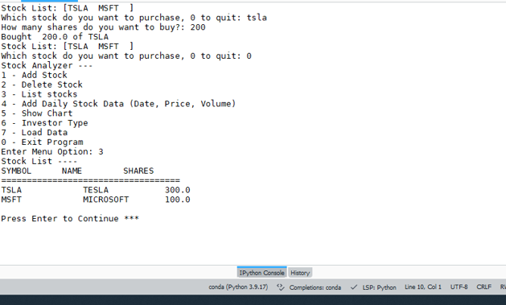
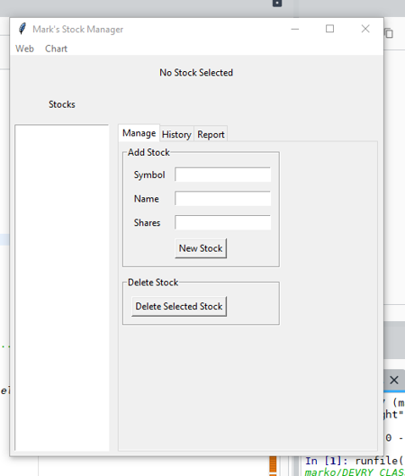
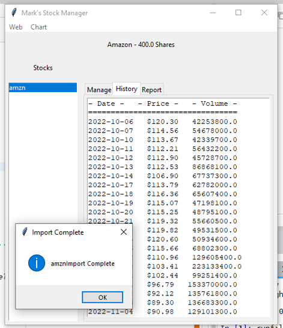
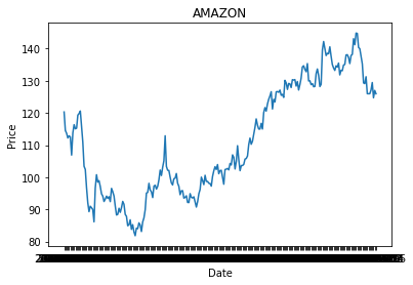

# Personal Stock Tracking Application in Python

In this project I will be developing an application in Python that allows a user to track his or her stocks. The application will be built using object oriented programming techniques in Python. The end user will be able to control the application through a console based interface and also a graphical user interface. The user will be able to import historical stock data and generate profit/loss reports as well as being able to generate charts for their stocks.

### Python Libraries

- Pandas
- Scipy
- tkinter (GUI)
- matplotlib

### Console Based Interface

### GUI

# Import Data Example

# Charting Example
